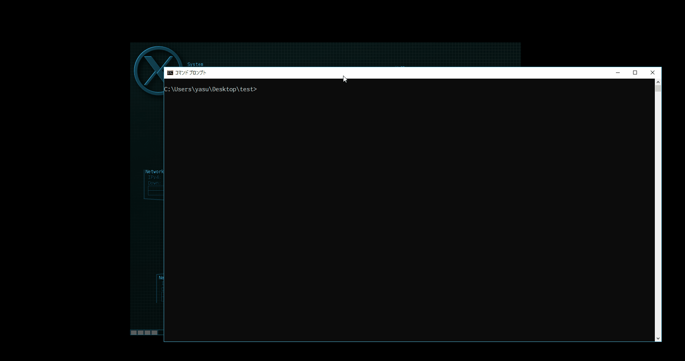

# fedit

fedit command renames files in the all them of directory. 
And you can edit with favorite editor, for example vim, emacs, notepad and gedit.

If you takes time with rename tasks, recommend this.



## Install

```
go get github.com/yasukotelin/fedit
```

## How to use

```
$ fedit --help
feditelin is the tool to rename all files in directory

Usage:
  feditelin [flags]

Flags:
  -e, --editor string   specify the editor to open.  (default "notepad")
  -h, --help            help for feditelin
      --version         version for feditelin


```

### Specify editor

You can specify the favorite editor with `-e` option.

```
fedit -e gvim ./
```

> **NOTE** Default editor is notepad when uses on the windows, and it's vim when on the other os.
