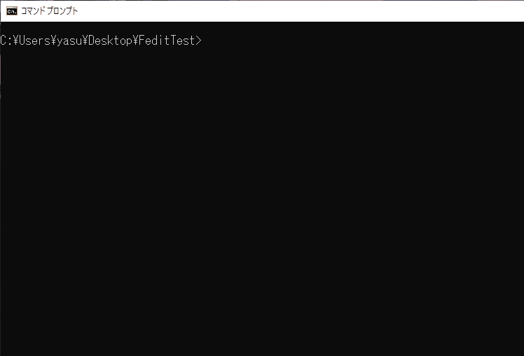

# fedit

fedit renames the files📝 in the specified directory🗂. </br>
And you can edit with favorite editor, for example vim, emacs, notepad and gedit.

If you have to need to rename a much files, recommend to use this😋.

<p align="center">
    
</p>

## Install

### Using go

```
go get github.com/yasukotelin/fedit
```

### for Winsows

If you are windows user, you can just only [download]() and use easily.

## How to use

```
fedit ./
```

When you run `fedit` with specifying the directory, the file list is opened by **Default editor**.
Default editor is notepad when uses on the windows, and it's vim when on the other os.

### Specify editor

You can specify the favorite editor with `-e` option.

```
fedit -e gvim ./
```


### Help

```
fedit --help
```
